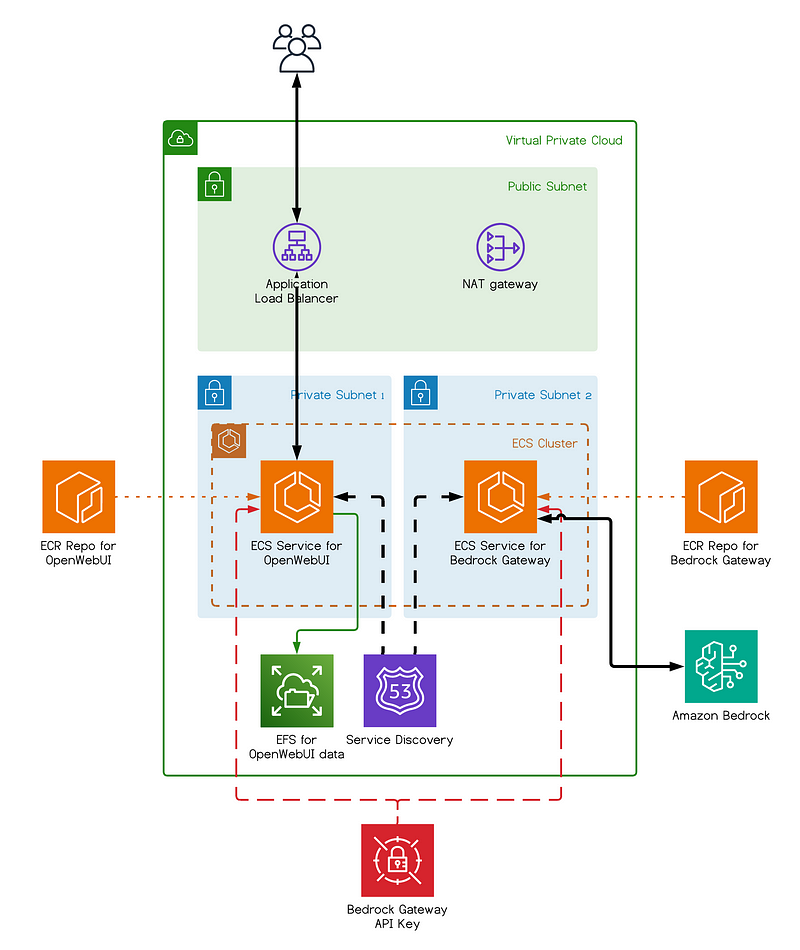
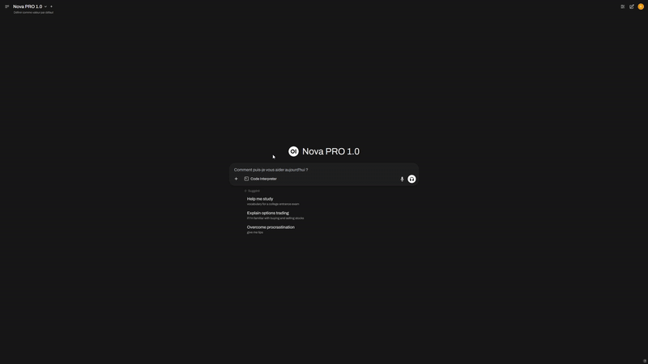

# 🧠 AskLabs.ai — AWS Bedrock Chatbot

Deploy your own self-hosted ChatGPT-like interface powered by **Amazon Bedrock**, using **Open WebUI** and **Bedrock Access Gateway**, fully containerized and deployed with **Terraform** on **AWS ECS** with custom domain support.

## 🚀 What is AskLabs.ai?

AskLabs.ai is a production-ready generative AI chatbot platform powered by AWS Bedrock models like Claude or Titan, providing a sleek ChatGPT-style interface for LabsDAO and the broader AI community.

You'll get:

- 🧱 **Amazon Bedrock** access (Claude, Titan, etc.)
- 💬 **Open WebUI** for a ChatGPT-style interface
- 🔁 **Bedrock Access Gateway (BAG)** for OpenAI-compatible API access
- 🌐 **Custom Domain Support** (asklabs.ai)
- ☁️ Deployed on **AWS ECS Fargate**
- 🔒 **EFS, Secrets Manager, IAM, VPC, ALB** — all built-in

## 📦 Architecture Overview



## ⚙️ Requirements

- AWS CLI configured with a profile
- AWS Account ID
- Terraform installed (`>= 1.9.5`)
- Access to Amazon Bedrock models ➜ [Request access here](https://docs.aws.amazon.com/bedrock/latest/userguide/model-access.html)
- Domain name (optional, for custom domain deployment)

## 🧪 Quick Start

### Option 1: Standard Deployment
```bash
git clone https://github.com/LabsDAO/aws-bedrock-chatbot.git
cd aws-bedrock-chatbot
./deploy.sh
```

### Option 2: Custom Domain Deployment (Recommended)
```bash
git clone https://github.com/LabsDAO/aws-bedrock-chatbot.git
cd aws-bedrock-chatbot
./deploy-custom-domain.sh
```

Once the script is done, you'll get a DNS output. Open it in your browser, register an account, and start chatting with Bedrock LLMs!

## 🌐 Custom Domain Setup

For custom domain deployment (like asklabs.ai), the deployment will:

1. **Create Route53 Hosted Zone** for your domain
2. **Generate SSL Certificate** via AWS Certificate Manager
3. **Configure Application Load Balancer** with HTTPS
4. **Provide Nameservers** to update at your domain registrar

### Domain Registrar Configuration

After deployment, update your domain registrar (e.g., Namecheap, GoDaddy) with the provided AWS nameservers:

```
ns-1513.awsdns-61.org
ns-1677.awsdns-17.co.uk
ns-649.awsdns-17.net
ns-70.awsdns-08.com
```

## 🔧 Troubleshooting

⚠️ **Memory Issue**: If the Open WebUI frontend build fails (due to memory), the deployment script automatically fixes this by updating the Dockerfile with `RUN NODE_OPTIONS="--max-old-space-size=4096" npm run build`

## 🏗️ Infrastructure Components

- **ECS Cluster**: Fargate-based container orchestration
- **Application Load Balancer**: HTTPS termination and routing
- **EFS**: Persistent file storage
- **VPC Endpoints**: Secure AWS service access
- **Secrets Manager**: Secure credential storage
- **Route53**: DNS management and health checks

## 🎯 Use Cases

- **LabsDAO Internal Tools**: AI-powered assistance for development teams
- **Research & Development**: Testing and prototyping with various LLM models
- **Custom AI Applications**: Building on top of the Bedrock Access Gateway API
- **Educational Platform**: Learning and experimenting with generative AI

## 📄 License
MIT — feel free to fork and build upon it!

## 🤝 Contributing

This project is maintained by LabsDAO. Contributions are welcome! Please feel free to submit issues and pull requests.

